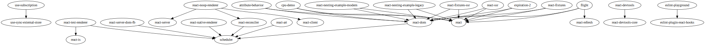

# package-json-graph
  
Generate a graph using several package.json files (suitable for mono-repo codebases)

## Start
```
npx package-json-graph
```
This will generate a file `./graph.svg` similar to this one (generated for React repo from Github):  


## Install
```
npm i -D package-json-graph
```

## CLI Options
### --format (default "svg")  
values: "dot" or "svg"
### --out (default "./graph")  
Output file name without extension (the extension is added from the format option)